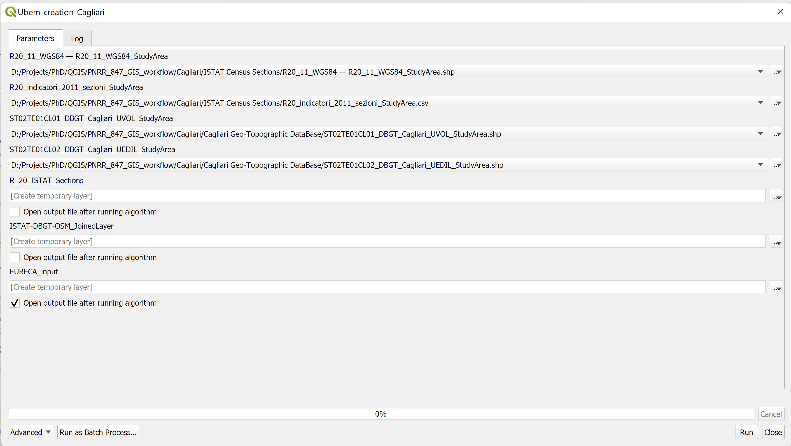

# UBEM creation from open datasets (Cagliari example)

This repository includes a set of QGIS graphical models allowing an automatic execution of pre-processing operations on open GIS datasets (concerning a selected study area in Cagliari, Italy) to generate a suitable input file for an EUReCA-based UBEM

### Get QGIS input datasets
From the folder *Cagliari*, extract *CagliariSampleInputs.rar*. This archive holds GIS input layers concerning the selected study area in Cagliari (Italy). The input included in this precompilated project are open data sources, similar to those used in the Padova project, that can be freely downloaded. In particular the data sources are: 

1. ISTAT census sections (shapefile can be found under the section **Basi territoriali - dati definitivi (1991-2011)**) [ISTAT website](https://www.istat.it/it/archivio/104317#accordions)
2. ISTAT census indicators (csv file can be found under the section **Variabili censuarie (1991-2011)**) [ISTAT website](https://www.istat.it/it/archivio/104317#accordions)
3. Geo-Topographic Database (GTDB) of Sardinian cities (shape files of the city of Cagliari can be freely downloaded by clicking on the *CAGLIARI* archive) [Sardinia Geoportal](https://www.sardegnageoportale.it/index.php?xsl=2420&s=40&v=9&c=95648&na=1&n=10&esp=1&tb=14401)

*Note that only two layers (called CLASSES) of the Cagliari GTDB, both concerning buildings, are involved in the proposed workflow: the 'Volume Unit' class (Layer name: "**ST02TE01CL01**"), the 'Building Unit' class (Layer name: "**ST02TE01CL02**").

You can extract the zip file to get this default files for Padova. 

> Cagliari\CagliariSampleInputs.rar

### Open QGIS project

Open the project file:

> Cagliari\Project Cagliari.qgz

### Run the project

Make sure to have an active internet connection. From the processing toolbox, open the process *Models/ubem_creation_Cagliari*. Add the input files to the respective field as shown in the Figure:

Click on Run to get the Cagliari UBEM input data. This process will print a new shapefile, ready to use in the [EUReCA](https://github.com/BETALAB-team/EUReCA) UBEM software to run UBEm simulations.
