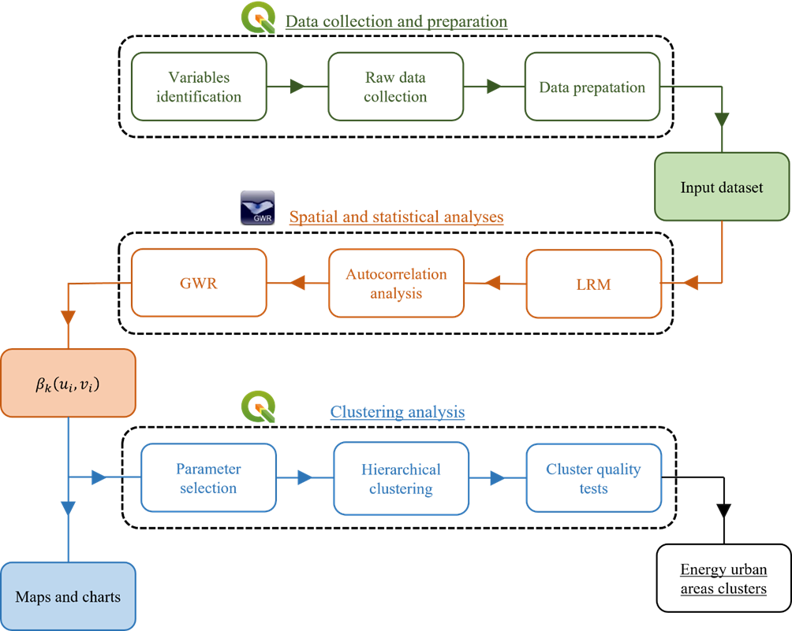

# Urban spatial energy analysis and clustering (Napoli example)

This directory holds sample files to run GIS-based statistical and spatial analyses to interpret how different urban features can affect the energy consumption in a city, and how urban environments can be clusterized to run early stage energy analyses and urban planning in the context of carbon reduction policies. In particular this methodology of the NEST UBEM processing tools provides a first shapefile of Napoli's census tracts already preprocessed, that can be used as an input file for the spatial analysis using [GWR4](https://gwr.maynoothuniversity.ie/gwr4-software/). 

The methodology consists in 3 major steps:

1. **Data collection and preprocessing**
   
   The first phase concerns the collection of data and preparation of the dataset, in this case run at the censu tract level. Following previous works on the topic,  a set of significant groups of variables was selected: environmental context, building stock characteristics, socio-economic condition, electric energy consumption. The results of this preprocessing is included in 

2. **GWR statistical and spatial analyses**
   
   This phase consists of running ..

3. **Clustering**
   
   This phase consists of running ..

### Detailed list of considered variables

-	Electrical energy demand
-	Physical urban features:
    -	Ratio between census tracts and residential buildings surfaces 
    -	Density of residential building (ratio between the volume of residential buildings and territorial surface)
    -	Average number of floors in residential buildings
    -	Density of building per census tracts (ratio between number of buildings and census tract territorial surface)
    -	Density of residential building per census tracts (ratio between number of residential buildings and census tract territorial surface)
    -	Density of not-residential building per census tracts (ratio between number of not-residential buildings and census tract territorial surface)
    -	Density of built areas (ratio between built volume and census tract territorial surfaces)
    -	Average height of buildings per census tract
    -	Ratio between average height of buildings and distance between façades on two street fronts
    -	Average compactness ratio for residential buildings (ratio between envelope surface and volume)
    -	Cover Index (ratio between built area and territorial surface)
    -	Density of dwellings (ratio between number of dwellings per census tract and census tract territorial surface)
    -	Density of rooms (ratio between number of rooms per census tract and census tract territorial surface)
    -	Utilisation index (ratio between total surface of dwellings and territorial surface per census tract)
    -	Utilisation index for occupied residential buildings (ratio between number of occupied dwellings and territorial surface per census tract)
    -	Density of total population (ratio between total population and territorial surface)
    -	Ratio between population aged between 0 and 19 and total population
    -	Ratio between population aged between 20 and 64 and total population
    -	ratio between population aged over 65 and total population 
    -	Density of green areas (ratio between green surfaces and census tract territorial surfaces)
    -	Density of masonry buildings (ratio between number of masonry buildings and census tract territorial surface)
    -	Density of concrete buildings (ratio between number of concrete buildings and census tract territorial surface)
    -	Residential buildings construction year classes
    -	Green urban areas
-	Socio-economic urban features:
    -	Ratio between university graduated population and total population aged over 6
    -	Ratio between high school graduated population and total population aged over 6
    -	Ratio between elementary or middle school graduated population and total population aged over 6
    -	Ratio between illiterate population and total population aged over 6
    -	Ratio between population in workforce (aged over 15) and total population
    -	Ratio between employed population and total population
    -	Ratio between unemployed population and total population
    -	Employment index (ratio between employed population and population in workforce)
    -	Unemployment index (ratio between unemployed population and population in workforce)
    -	Ratio between self-employed population and employed population
    -	Ratio between employees and employed population
    -	Population not in workforce
    -	Ratio between annual household income and total population
-	Environmental context features:
    -	Annual average of maximum and minimum temperatures
    -	Annual average precipitation
    -	Macroclimatic zone
