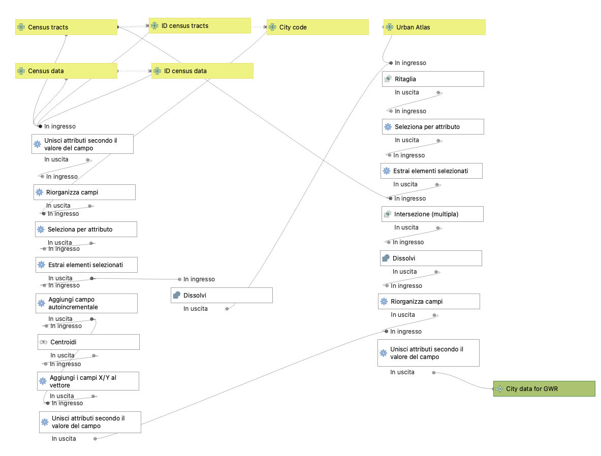

This directory holds sample files to run GIS-based statistical and spatial analyses to interpret how different urban features can affect the energy consumption in a city, and how urban environments can be clusterized to run early-stage energy analyses and urban planning in the context of carbon reduction policies. In particular this methodology of the NEST UBEM processing tools provides a first shapefile of Napoli's census tracts already preprocessed, that can be used as an input file for the spatial analysis using [GWR4]([https://gwr.maynoothuniversity.ie/gwr4-software/) .

 

The methodology consists in 3 major steps:
### 1.	Data collection and preprocessing
The first phase concerns the collection of data and preparation of the dataset, in this case run at the census tract level. Following previous works on the topic, a set of significant groups of variables was selected: *environmental context*, *building stock characteristics*, *socio-economic condition*, *electric energy consumption*. The workflow of this preprocessing includes the identification of variables, data collection and data preparation. This folder includes the raw dataset needed to prepare the input of the following methodological steps, in particular for the first case study of the method, Naples. The datasets are:
-	R15_11_WGS84 - ISTAT Campania region census tracts (shapefile);
-	R15_indicatori_2011 - ISTAT census data per each census tract (xls file);
-	NaplesUrbanAtlas – Geopackage of urban polygons of Naples;
-	Electricity – The electrical annual consumption per each census tract (shapefile). 

Moreover, the folder includes a **QGIS model** to run automatically the preprocessing analyses for the following statistical and spatial analyses to be run in GWR4.
Please, open the attached QGIS project and launch the UNINA_workflow model. 
Launching the model, a few information needs to be added in order to run the algorithm. In particular, the user has to clarify the model inputs and essential vector fields to compute the analyses. In particular:
-	Census data stand for the data collected at census tracts level (R15_indicatori_2011 in this case);
-	Census tracts are the polygons of the census (R15_11_WGS84 in this case);
-	Urban Atlas (NaplesUrbanAtlas in this case);
-	Electrical consumption (NaplesElectricalconsumption in this case);
-	City code is the univocal code of the case study city. PRO_COM is the ISTAT identifier of each city;
-	ID census data and ID census tracts is the univocal identifier of census tracts (in this case SEZ2011 is the thirteen-numbers string which identify each census tract univocally).

The output of the model is a shapefile which contain for each census tract of Naples relevant data for further statistical analyses: electrical consumption, socio-economic and built environment data. 
The full list of variables is below.
Moreover, it includes three fields, ID, x and y, respectively a shorter identifier of census tracts, longitude and latitude of cells’ centroids. Such data were added in order to run analyses through another software, GWR4, which was selected because more robust than QGIS plugin and yet open source.

Please, find in this folder a pdf print of the model for an insight of the whole process.

*Once the model has run, please export the final output into csv format or txt to be run into GWR4.*
### 2.	GWR statistical and spatial analyses
This phase consists of running statistical and spatial analyses to obtain a model defining the strength (magnitude of closeness) and the kind (positive or negative) of relationships between the dependent variable (residential electric energy consumption) and independent variables (concerning urban physical and socio-economic environment). 

Geographically weighted regression (GWR) analyses were chosen to investigate spatial heterogeneities and relationships between energy usage and urban environment features. 

First, an exploratory global regression analysis will be performed to understand how the predictors relate to the response variable. Specifically, which relationships are statistically significant, whether there is evidence for specifying an autocorrelated error term and the fit of the LRM itself. Using the Global Moran's I Statistics and given a set of features and an associated attribute, the autocorrelation analysis calculates a z-score and p-value to indicate whether the null hypotheses can be rejected. In this case, the null hypothesis states that the values of the features are spatially uncorrelated.

The degree of correlation between variables is a crucial factor to consider before conducting the two spatial analyses, to avoid data redundance and multi-collinearity. To choose the best set of variables with a low level of multi-collinearity, it is necessary to execute an exploratory regression analysis. 

Following the exploratory regression analysis and choosing the best set of variables, spatial statistical analyses were run to determine the relationships between urban characteristics and energy consumption. The best viable set obtained is analysed by applying OLS and GWR regressions. The regression models (GWR and OLS) with selected variables allows for an interpretation of the spatial dynamics of energy consumption by highlighting spatial dependency, nonstationary and correction. It is especially useful for identifying the spatial distribution of relations between the energy consumption and selected variables. Maps and statistical charts will be developed, employing data classification schemes informed by the (nonspatial) data distribution, diverging colour schemes, and bivariate choropleth mapping, in order to highlight whether the relationships between dependent and independent variables are significant and, where they are, whether they are positive or negative.
### 3. Clustering
This phase consists of running cluster analyses of βk (ui,vi) coefficients, will return a classification of urban areas according to significant urban characteristics and relative electricity consumption per inhabitant. The results of this last phase will return a discretisation of the studied area according to the degree of energy consumption.

**Detailed list of considered variables**

- Electrical energy demand
-	Physical urban features:
    -	Ratio between census tracts and residential buildings surfaces 
    -	Density of residential building (ratio between the volume of residential buildings and territorial surface)
    -	Average number of floors in residential buildings
    -	Density of building per census tracts (ratio between number of buildings and census tract territorial surface)
    -	Density of residential building per census tracts (ratio between number of residential buildings and census tract territorial surface)
    -	Density of not-residential building per census tracts (ratio between number of not-residential buildings and census tract territorial surface)
    -	Density of built areas (ratio between built volume and census tract territorial surfaces)
    -	Average height of buildings per census tract
    -	Ratio between average height of buildings and distance between façades on two street fronts
    -	Average compactness ratio for residential buildings (ratio between envelope surface and volume)
    -	Cover Index (ratio between built area and territorial surface)
    -	Density of dwellings (ratio between number of dwellings per census tract and census tract territorial surface)
    -	Density of rooms (ratio between number of rooms per census tract and census tract territorial surface)
    -	Utilisation index (ratio between total surface of dwellings and territorial surface per census tract)
    -	Utilisation index for occupied residential buildings (ratio between number of occupied dwellings and territorial surface per census tract)
    -	Density of total population (ratio between total population and territorial surface)
    -	Ratio between population aged between 0 and 19 and total population
    -	Ratio between population aged between 20 and 64 and total population
    -	ratio between population aged over 65 and total population 
    -	Density of green areas (ratio between green surfaces and census tract territorial surfaces)
    -	Density of masonry buildings (ratio between number of masonry buildings and census tract territorial surface)
    -	Density of concrete buildings (ratio between number of concrete buildings and census tract territorial surface)
    -	Residential buildings construction year classes
    -	Green urban areas
-	Socio-economic urban features:
    -	Ratio between university graduated population and total population aged over 6
    -	Ratio between high school graduated population and total population aged over 6
    -	Ratio between elementary or middle school graduated population and total population aged over 6
    -	Ratio between illiterate population and total population aged over 6
    -	Ratio between population in workforce (aged over 15) and total population
    -	Ratio between employed population and total population
    -	Ratio between unemployed population and total population
    -	Employment index (ratio between employed population and population in workforce)
    -	Unemployment index (ratio between unemployed population and population in workforce)
    -	Ratio between self-employed population and employed population
    -	Ratio between employees and employed population
    -	Population not in workforce
    -	Ratio between annual household income and total population
-	Environmental context features:
    -	Annual average of maximum and minimum temperatures
    -	Annual average precipitation
    -	Macroclimatic zone

# Workflow
The workflow of the model can be seen in the figure below. 

