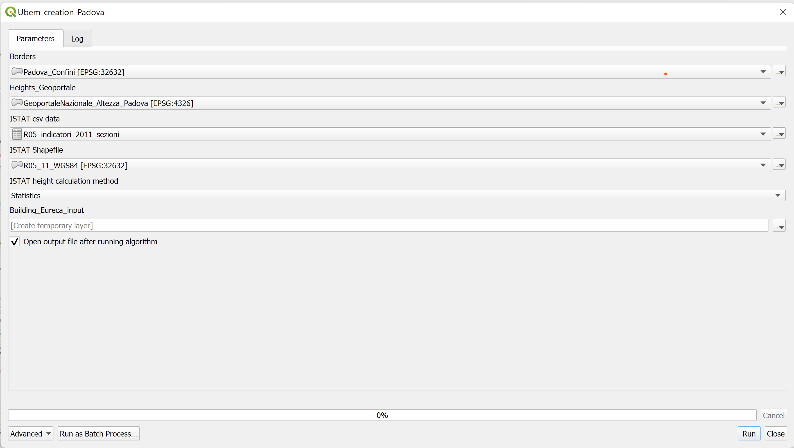

# UBEM creation from open datasets (Padova example)

### Model creation
Inside the **Padova/PadovaSampleInputs.zip** archive, you can find the starting data to run the Padova project. The project needs four input files. 

1. Census tract shapefile for the desired region. This data is downloadable from the [ISTAT](https://www.istat.it/it/archivio/104317#accordions) website. 
The shapefile can be found under the section **Basi territoriali - dati definitivi (1991-2011)**

1. Census tract indicators, which is a csv file that can be found in the same [link](https://www.istat.it/it/archivio/104317#accordions). 
This file can be found under the section **Variabili censuarie (1991-2011)**

1. Height data from national geoportal. This data is a wfs data that can be queried with this [link]( http://wms.pcn.minambiente.it/ogc?map=/ms_ogc/wfs/Edifici.map&).

2. A shapefile defining the borders of the desired area. This shapefile can be made using basic polygons in the QGIS. 

You can extract the zip file to get this default files for Padova. 

> Padova/PadovaSampleInputs.zip

### Open QGIS project

Open the project file:

> Padova\Padova_Project.qgz

### Run the project

Make sure to have an active internet connection. From the processing toolbox, open the process *Models/ubem_creation_Padova*. Add the input files to the respective field as shown in the Figure:

Click on Run to get the Padova UBEM input data. This process will print a new shapefile, ready to use in the [EUReCA](https://github.com/BETALAB-team/EUReCA) UBEM software to run UBEm simulations.