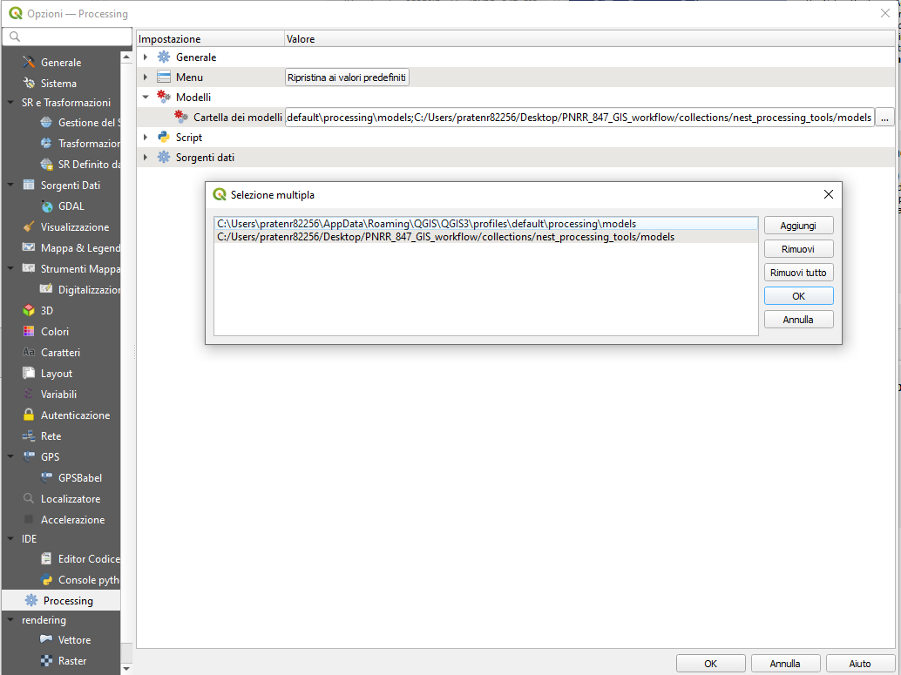
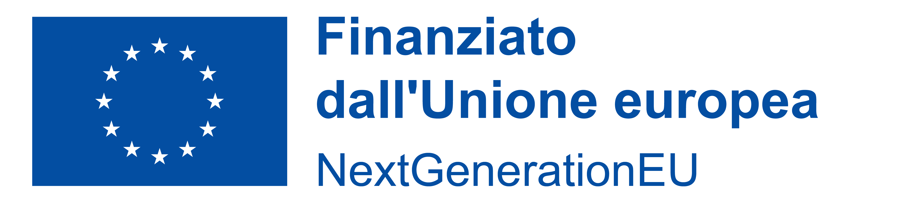

# NEST UBEM processing tools

This repository includes a set of QGIS processing models to create UBEM input dataset for a quick simulation in the [EUReCA](https://github.com/BETALAB-team/EUReCA) environment, starting from national GIS datasets. The project has been carried on in the context of the PNRR project NEST, task 8.4.7 (see below for futher information).

## Download the repository

Download the repository to your local storage either using the zip file, going to:

> Code -> Download ZIP

or directly cloning the repository.

> git clone https://github.com/BETALAB-team/NEST-UBEM-processing-tools.git

*Note: If you download the file as a zip file, you should first extract it.

## Setup QGIS

### Models path config
This tools are based on the QGIS software. Be sure QGIS is installed on your PC.

To load the NEST processing tools: 

1. Open QGIS
2. Go to *Setting* -> *Options*
3. Move to the *Processing* tab, inside models. 
4. Add the *path/to/the/repo/collections/nest_processing_tools/models* path to your list of models paths:

5. Click ok to load the models.
6. Inside yor processing toolbar, in the models section, you can find the NEST UBEM processing algorithms

### OSM plugin installation
The tools provided by this repo rely on the [QuickOSM](https://plugins.qgis.org/plugins/QuickOSM/) plugin. This plugin is used to get the data from OpenStreetMap database. 
If you have not yet installed this plugin go to the following section from the menu bar:

> Menu ribbon -> Plugin -> Manage and Install Plugins

Here search for the QuickOSM plugin and install it.
If necessary, refer to the official [QGIS plugin guide](https://www.qgistutorials.com/en/docs/3/using_plugins.html). 

## Run a first example

### Processing national datasets to extract significant UBEM features

Example files concerning [Padova](https://github.com/BETALAB-team/PNRR_847_GIS_workflow/tree/dev/Padova) and [Cagliari](https://github.com/BETALAB-team/PNRR_847_GIS_workflow/tree/dev/Cagliari) are provided with proper documentation. Try to open one project extract from national databases 

## Acknowledgements

- **Funder**: Project funded under the National Recovery and Resilience Plan (NRRP), Mission 4 Component 2 Investment 1.3 - Call for tender No. 1561 of 11.10.2022 of Ministero dell’Uni-
versità e della Ricerca (MUR); funded by the European Union – NextGenerationEU

- **Award Number**: Project code PE0000021, Concession Decree No. 1561 of 11.10.2022 adop-
ted by Ministero dell’Università e della Ricerca (MUR), CUP - to be indicated by each Beneficiary, according to attachment E of Decree No. 1561/2022, Project title “Network 4 Energy Sustainable Transition – NEST”

