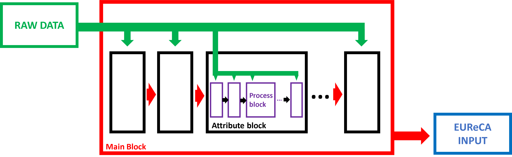
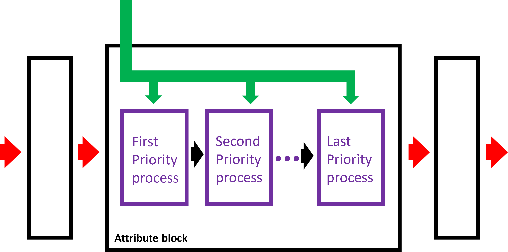
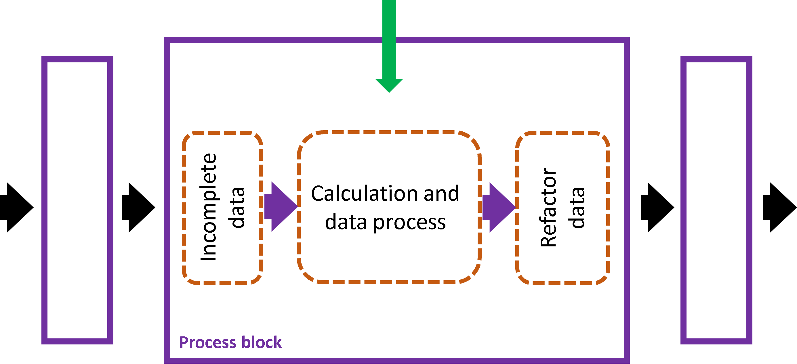

# NEST UBEM processing tools - Documentation

## 1. Framework
This project is based on the geospatial data which are not usually easily available or in a unique format. In order to have a more flexible and compatible approach, the workflow is framed in three stages.
- **Main Block:** the main line of the process. in this block the raw input data is used to create the output shapefile in a step-by-step mode. this block gets the input data and gives the final 3d file which can be used in EUReCA. this block is constructed by several attribute blocks.  

 

- **Attribute Blocks:** their objective is focused on one or some related variables. for instance, the height blocks gets as an input a shapefile that does not have complete assigned height attribute. Using different data sources, in this line of procedure the attribute can be assigned to the shapefile. This block contains one or more process blocks which are ordered by their priority and data quality.  

 

- **Process Blocks:** The core of the process, they are costumized to use a certain data source for calculating the distinguished variable. The input to this block is a partially complete (or an incomplete) shapefile. The block calculates the variable using its designated data source. Then using refactor function, this calculated variable is added only to the features that lacked it.  

 

## 2. Editing and New Block Creation
### Process Blocks 
In order to edit or create the process blocks, some important notes are to be considered:
- There should always be a vector layer input to be linked to the previous point in the procedure. 
- If an additional input is requried, after adding its block to the process block, it should be copied and pasted in the attribute block and the main block. 
- It is a good practice to calculate the desired value as a dummy variable and then assign it using refactor field. The refactor field tools can be copied and pasted from any process toolbox in this project. 
- To refactor the fields, for the desired variable ***X***, having calculated the dummy variable ***X_dummy*** it is possible to if statement, While for any other variable ***Y***, the code should be set to not change the variable:
> X=if("X" is NULL, "X_dummy", "X")  
> Y="Y"
- If you want your changes to be integrated with the project, you need to save your changes. If it is a new model, you can save it in the same folder as others for the ease of access.

### Attribute Blocks
The attribute blocks are designed to go through different process blocks based on their priority. To change the order of priority, it is possible to change the links between the process blocks. All the process blocks have one output so the attribute block should look like a chain in the end. As soon as you save your changes to the attribute block, they will be in effect in the whole project. 
