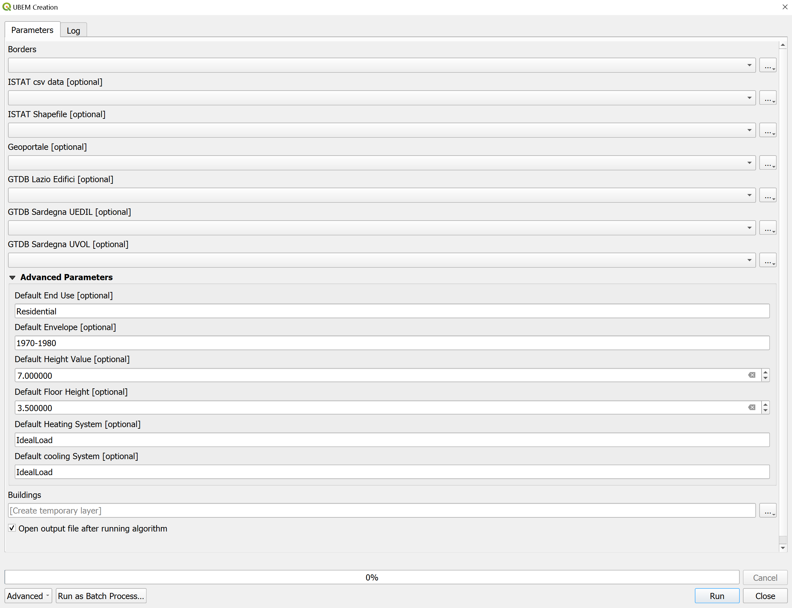

# NEST UBEM processing tools

This repository includes a set of QGIS processing models to create UBEM input dataset for a quick simulation in the [EUReCA](https://github.com/BETALAB-team/EUReCA) environment, starting from national GIS datasets. The project has been carried on in the context of the PNRR project NEST, task 8.4.7 (see below for futher information).

## Download the repository

Download the repository to your local storage either using the zip file, going to:

> Code -> Download ZIP

or directly cloning the repository.

> git clone https://github.com/BETALAB-team/NEST-UBEM-processing-tools.git

*Note: If you download the file as a zip file, you should first extract it.

## Setup QGIS

### Models path config
This tools are based on the QGIS software. Be sure QGIS is installed on your PC.

To load the NEST processing tools: 

1. Open QGIS
2. Go to *Setting* -> *Options*
3. Move to the *Processing* tab, inside models. 
4. Add the *path/to/the/repo/collections/nest_processing_tools/models* path to your list of models paths:

5. Click ok to load the models.
6. Inside yor processing toolbar, in the models section, you can find the NEST UBEM processing algorithms

### OSM plugin installation
The tools provided by this repo rely on the [QuickOSM](https://plugins.qgis.org/plugins/QuickOSM/) plugin. This plugin is used to get the data from OpenStreetMap database. 
If you have not yet installed this plugin go to the following section from the menu bar:

> Menu ribbon -> Plugin -> Manage and Install Plugins

Here search for the QuickOSM plugin and install it.
If necessary, refer to the official [QGIS plugin guide](https://www.qgistutorials.com/en/docs/3/using_plugins.html). 

## Run a first example

You can use example files concerning [Padova](https://github.com/BETALAB-team/PNRR_847_GIS_workflow/tree/dev/Padova), [Cagliari](https://github.com/BETALAB-team/PNRR_847_GIS_workflow/tree/dev/Cagliari) and [Roma](https://github.com/BETALAB-team/PNRR_847_GIS_workflow/tree/dev/Roma) to run a first example. 

In the QGIS from the processing toolbox panel, under the Models section, choose *UBEM Creation* toolbox. A window will open where you should choose the proper inputs and click Run. 

## Model Inputs
### Borders
 The extent of of the studied area. This input is the only mandatory input and it can be any vector file with polygons. The Model will be created for the buildings that fall within the polygons included in this input.  
- *The Extent of Padova Municipality and also Rome is included as a shapefile in the example files.*

### ISTAT csv data 
Census tract indicators, which is a csv file that can be found in the this [link](https://www.istat.it/it/archivio/104317#accordions). 
This file can be found under the section **Variabili censuarie (1991-2011)**
- *This csv file is included in the example files for Padova, Cagliari and Roma*
### ISTAT Shapefile
Census tract shapefile for the desired region. This data is downloadable from the [ISTAT](https://www.istat.it/it/archivio/104317#accordions) website. 
The shapefile can be found under the section **Basi territoriali - dati definitivi (1991-2011)**
- *This shapefile is included in the example files for  Padova, Cagliari and Roma*

### Geoportale
Height data from national geoportal. This data is a wfs data that can be queried with this [link]( http://wms.pcn.minambiente.it/ogc?map=/ms_ogc/wfs/Edifici.map&).
- *This shapefile is included in the example files for Padova Municipality*

### GTDB Sardegna UVOL and UEDIL
Geo-Topographic Database (GTDB) of Sardinian cities [Sardinia Geoportal](https://www.sardegnageoportale.it/index.php?xsl=2420&s=40&v=9&c=95648&na=1&n=10&esp=1&tb=14401) 
Only two layers (called CLASSES) of the Cagliari GTDB, both concerning buildings, are involved in the proposed workflow: the 'Volume Unit' class (Layer name: "**ST02TE01CL01**"), the 'Building Unit' class (Layer name: "**ST02TE01CL02**").
- *This shapefile is included in the example files for the city of Cagliari*

### GTDB Lazio Edifici
Geo-Topographic Database (GTDB) of cities of Lazio Region (shape files of the city of Roma can be freely downloaded by clicking on the *DBT_Lazio_RM* archive) [Regione Lazio Open Data](http://dati.lazio.it/catalog/it/dataset/2014-carta-tecnica-regionale-numerica-scala-1-5-000-provincia-di-roma) 
Only one layers (called CLASS) of the Roma GTDB, both concerning buildings, is currently involved in the proposed workflow: the 'Building Unit' class (Layer name: "**EDIFC**")
- *This shapefile is included in the example files for the city of Roma*

### Advanced Parameters
Default values that are given to the buildings if other databases were not available for them. 

## Acknowledgements

- **Funder**: Project funded under the National Recovery and Resilience Plan (NRRP), Mission 4 Component 2 Investment 1.3 - Call for tender No. 1561 of 11.10.2022 of Ministero dell’Uni-
versità e della Ricerca (MUR); funded by the European Union – NextGenerationEU

- **Award Number**: Project code PE0000021, Concession Decree No. 1561 of 11.10.2022 adop-
ted by Ministero dell’Università e della Ricerca (MUR), CUP - to be indicated by each Beneficiary, according to attachment E of Decree No. 1561/2022, Project title “Network 4 Energy Sustainable Transition – NEST”

